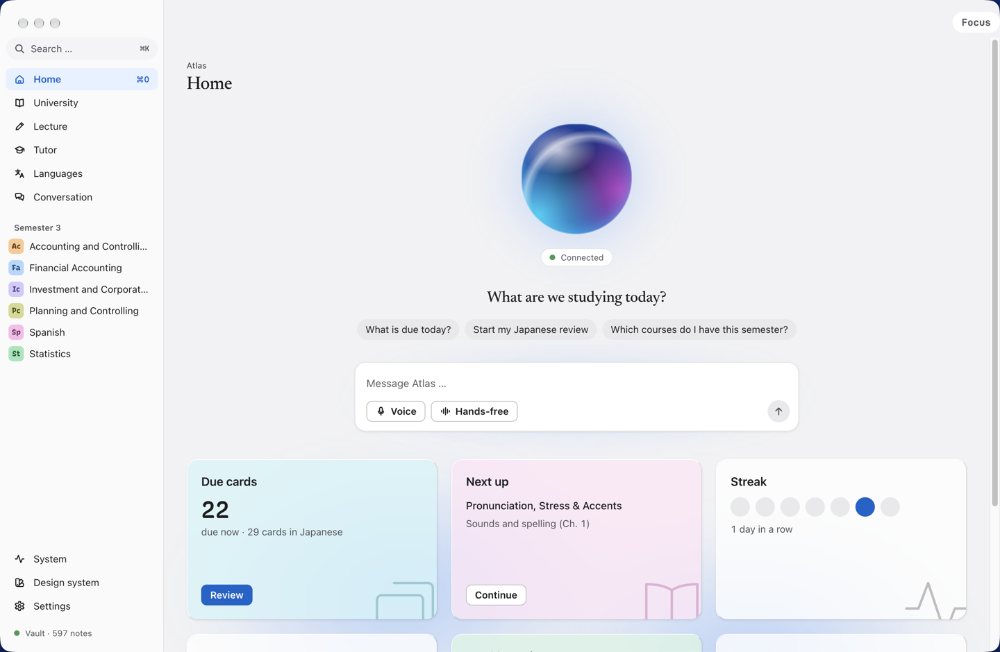
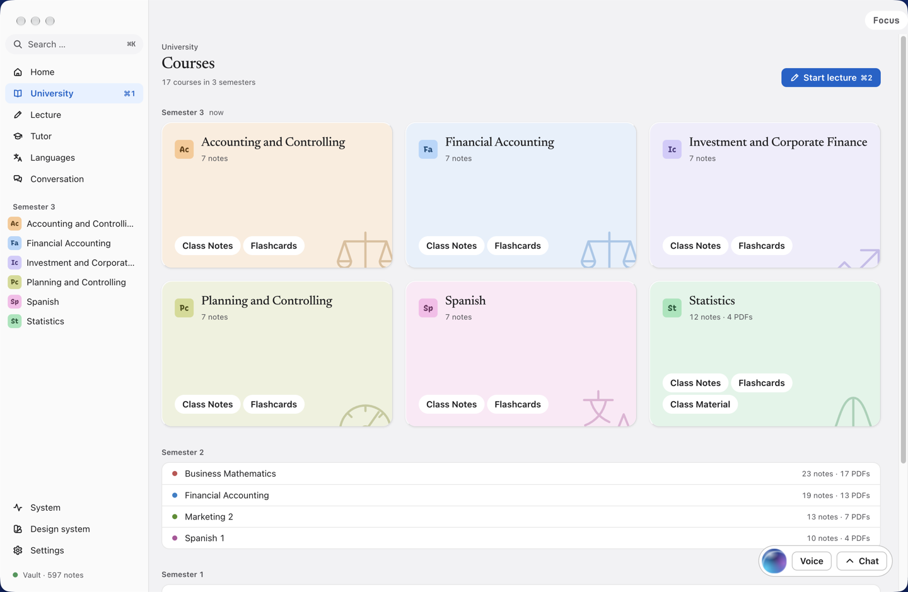
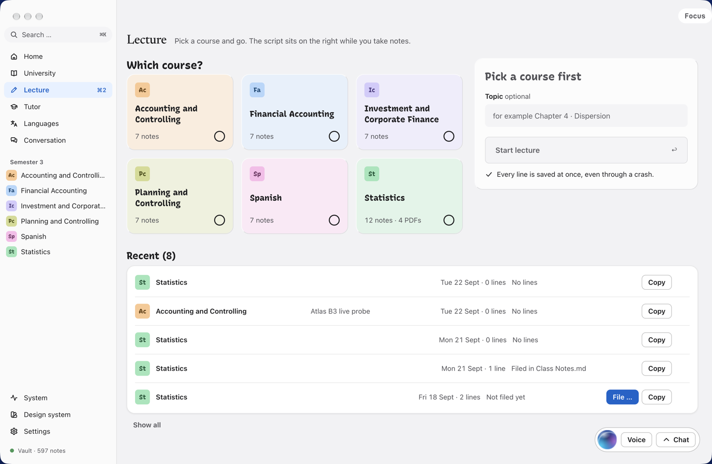
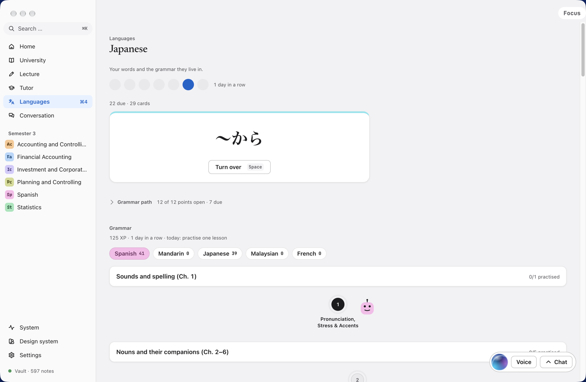

# Atlas

A study companion for your Obsidian vault. It makes flashcards from your notes, walks you through
grammar, takes lecture notes with you, and talks with you in the language you are learning.

**[→ Download the latest version](https://github.com/henribauer12-source/atlas-releases/releases/latest)**

Atlas runs on a Mac with Apple silicon (M1 or newer) and macOS 26 or newer.

---

## What it looks like

### Home

One place to land. The orb reacts when you or the agent speaks, and the cards below show what is
actually due today.



The agent can operate the app, not just chat: it reads your courses, starts a lecture, writes notes
and stages flashcards. When you leave Home, the conversation follows you as a bubble in the corner.
Without an ElevenLabs key it still works — you type instead of speaking.

### University

Every course from your vault, grouped by semester, with note and PDF counts from the live index.



Courses aren't configured in the app — they *are* your vault's folder structure. Add a folder in
Obsidian and it shows up here. Deleting Atlas loses nothing: every note and every review log stays
plain markdown that Obsidian can still read.

### Lecture

Pick a course, start, and type. The script sits on the right while you take notes, the tutor can
join, and everything is filed back into the course's notes when you're done.



Every line is written to disk as you type it, so a crash mid-lecture costs nothing.

### Languages

Flashcards scheduled by [FSRS](https://github.com/open-spaced-repetition/fsrs4anki), a grammar path
that unlocks as you go, and a streak to keep you honest.



A fresh install starts with Spanish. You can add other languages in Settings, each with its own
voice. There's also a **Conversation** tab for spoken practice, where words from the chat can be
added straight into your deck.

> The screenshots show a vault with three languages and 17 courses. Yours will show your own notes —
> Atlas has nothing of its own in it.

---

## What you need

| | Needed? | What it's for |
|---|---|---|
| **Obsidian** + a vault | Yes | Atlas reads and writes your notes |
| **Local REST API** plugin | Yes | lets Atlas save into your notes |
| **Claude Code** | Yes | the tutors, card suggestions, lecture answers |
| **ElevenLabs key** | Optional | spoken conversation and natural card voices |

Atlas works without ElevenLabs. You can still type to the agent, and cards are read in your Mac's
own voice. You just can't have a spoken conversation.

---

## 1. Install Atlas

1. Download the file ending in `.dmg` from the [latest release](https://github.com/henribauer12-source/atlas-releases/releases/latest).
2. Double-click it. A window opens with the Atlas icon and an Applications folder.
3. Drag the Atlas icon onto the Applications folder.
4. Close the window, then eject "Atlas" in the Finder sidebar. You can delete the `.dmg` now.

### macOS will stop it the first time

This is expected, and nothing is wrong with your Mac.

Apple checks every app that doesn't come from the App Store, looking for a signature the developer
pays Apple for each year. Atlas has no such signature, so macOS stops it once. You tell macOS you
trust Atlas, and after that it opens normally.

1. On the warning, click **Done** — *not* "Move to Trash".
2. Open **System Settings** → **Privacy & Security**.
3. Scroll to **Security**. You'll see a line saying Atlas was blocked. Click **Open Anyway**.
4. Confirm with your password or Touch ID, then click **Open Anyway** once more.

You only do this once.

---

## 2. Install Claude Code

Atlas uses Claude Code for its tutors, card suggestions and lecture answers. This part uses
Terminal, but it is two lines and you never need it again.

**You need a paid Claude plan** (Pro or Max) — the free tier won't work.

### Step by step

1. Open **Terminal**. Press `⌘ Space`, type `Terminal`, press Return.

2. Copy this line, paste it into Terminal, and press Return:

   ```
   curl -fsSL https://claude.ai/install.sh | bash
   ```

   It downloads and installs in under a minute. Text scrolling past is normal.

3. When it finishes, **close Terminal and open it again**. This matters — the new command isn't
   available in the old window.

4. Type this and press Return:

   ```
   claude
   ```

5. A browser page opens. Sign in with your Claude account and approve. Then go back to Terminal —
   it should say you're logged in. Type `exit` and press Return to leave.

6. Open Atlas → **Settings** → **Check again**. The Claude Code line should turn green.

### If step 4 says "command not found"

The installer put `claude` in a folder your shell doesn't look in yet. Paste this, press Return,
then close and reopen Terminal:

```
echo 'export PATH="$HOME/.local/bin:$PATH"' >> ~/.zshrc
```

### Keeping it working

The login expires every few weeks. When Atlas says Claude Code isn't reachable, open Terminal, type
`claude`, and sign in again.

---

## 3. Get an ElevenLabs key

This is optional — it gives Atlas a real voice and lets you have spoken conversations.

### Step by step

1. Go to **[elevenlabs.io](https://elevenlabs.io)** and click **Sign up**. The free plan works to
   try it out; a spoken conversation uses up its monthly allowance quickly, so check
   [their pricing](https://elevenlabs.io/pricing) if you want to use it daily.

2. Once signed in, go to **[elevenlabs.io/app/developers/api-keys](https://elevenlabs.io/app/developers/api-keys)**.
   (Or: click your profile icon at the bottom left → **Developers** → **API Keys**.)

3. Click **Create API key**.

4. Give it a name — `Atlas` is fine.

5. **Set the permissions.** This is the step people get wrong. The key must be allowed to use:

   - **Text to Speech**
   - **Conversational AI**

   If the dialog offers "Full access" or "Restricted", pick **Full access** unless you know you
   want to limit it. A key missing *Conversational AI* still reads cards aloud, but spoken
   conversation silently won't work.

6. Click **Create**, then **copy the key**. ElevenLabs shows it **only once** — if you close the
   window without copying, delete the key and make a new one.

7. In Atlas, paste it into the setup step, or later under **Settings** → **ElevenLabs key**.

### About voices

Atlas starts with a Spanish voice called **Gaby** from the ElevenLabs Voice Library. To use a
different voice, open ElevenLabs → **Voices**, pick one, copy its **Voice ID**, and paste it into
Atlas under **Settings** → your language → **Voice ID**.

### Your key stays on your Mac

Atlas saves it in a file in your home folder and reads it only when it speaks. It is never sent
anywhere except to ElevenLabs, and never shown on screen after you paste it.

---

## 4. Set up Obsidian

1. **Obsidian with a vault.** Get it from [obsidian.md](https://obsidian.md) and open your vault.
   In Atlas, click **Choose vault …** and pick your vault's folder — the top folder, the one you
   open in Obsidian.

2. **The Local REST API plugin.** In Obsidian: **Settings** → **Community plugins** → turn them on →
   **Browse** → search `Local REST API` → **Install**, then **Enable**. Atlas handles the rest.

   Atlas can only save while Obsidian is open.

---

## 5. Updates

Atlas checks once a day and tells you in **Settings** → **Updates** when a new version exists.
It never updates itself and never downloads anything on its own.

To update: click **Download**, quit Atlas (`⌘Q`), open the new `.dmg`, drag Atlas onto Applications,
and click **Replace**.

**Updating never loses anything.** Your notes live in your Obsidian vault; your cards, review
history and settings live in a separate folder that replacing the app doesn't touch.

If Updates says checks are off, paste this into the **Update feed** box:

```
https://raw.githubusercontent.com/henribauer12-source/atlas-releases/main/version.json
```

---

## Troubleshooting

**"Atlas is damaged and can't be opened."** macOS quarantines downloaded unsigned apps. Open
Terminal and paste:

```
xattr -dr com.apple.quarantine /Applications/Atlas.app
```

**Nothing is saved to my notes.** Obsidian must be running, with the Local REST API plugin enabled.

**The agent doesn't answer.** Check **Settings** → the Claude Code line. If it's not green, open
Terminal, type `claude`, and sign in again.

**Voice doesn't work but cards are read aloud.** Your ElevenLabs key is probably missing the
*Conversational AI* permission. Make a new key with full access.

---

## What it does with your things

Worth knowing before you install anything that reads your notes.

- **Your notes stay yours.** Atlas reads and writes the same markdown Obsidian does. Uninstall it
  and every note, every flashcard log stays readable in Obsidian. Nothing is locked in a format
  only Atlas understands.
- **Your cards and review history** live in a database in your Mac's own application folder, not in
  the vault — thousands of rows queried by date have no sensible place in markdown, and it keeps
  answering a card from churning your iCloud sync.
- **Your keys stay on your Mac.** The ElevenLabs key is a file in your home folder, read only when
  Atlas speaks. Claude Code is a program you install and log into yourself.
- **Atlas has no server.** There's no account, no telemetry, and nothing is uploaded anywhere. It
  talks to exactly three places: Obsidian on your own machine, ElevenLabs when it speaks, and
  Anthropic through the Claude Code you installed.
- **It is not signed by Apple**, which is why macOS stops it the first time. The trade-off is
  described above — a yearly Apple fee buys the signature; this app doesn't pay it.

## How it is built

Electron, with no bundler, no UI framework and no native modules. The renderer is plain ES modules
served over a privileged `atlas://` scheme with a real CSP, custom elements with a small store,
`node:sqlite` for card data, and two search indexes behind one router so that both `文法` and
substrings inside long German compounds are findable.

Four gates run on every install and abort it on failure: layer boundaries, a per-module size
budget, a file manifest, and a TypeScript check over JSDoc types. A fifth refuses to build if
anything key-shaped ever appears in a tracked file.

The source is a private repository — this one exists to hand out the app and explain it.
